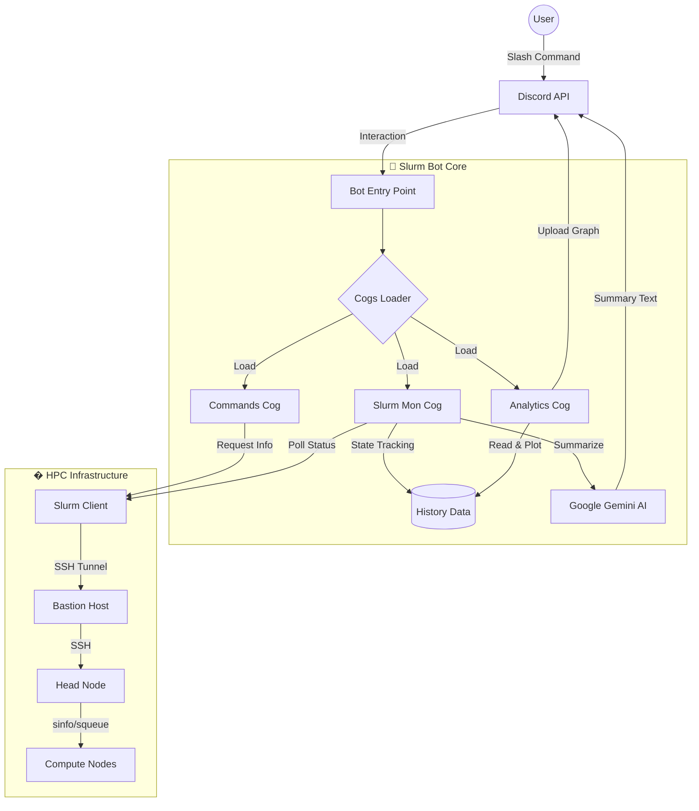

# ⚡ Slurm Cluster Monitor & Analyst Bot

A sophisticated **Discord Bot** designed to monitor High-Performance Computing (HPC) clusters managed by Slurm. It bridges the gap between complex terminal outputs and user-friendly visualizations, utilizing **Google Gemini AI** to provide human-readable summaries and **Matplotlib** for deep analytics.

## 🌟 Key Features

### 🧠 AI-Enhanced "Analyst"
*   **Gemini 2.5 Integration**: Instead of raw numbers, get intelligent summaries like *"huk120 is wide open with 128GB RAM"* or *"⚠️ High CPU Load on Partition Alto"*.
*   **Smart Parsing**: Converts raw `sinfo`/`squeue` data into concise, emoji-coded updates.

### � Advanced Visualization
*   **`/history` (Stacked Area Chart)**: Visualizes the cluster's **Capacity vs Usage** over the last 24 hours. Categories: 🟢 Idle, 🟡 Mixed, 🔴 Allocated, ⚫ Down.
*   **`/heatmap` (Utilization Grid)**: A temporal heatmap showing the exact state of **every single node** over time. Perfect for spotting stuck nodes or usage patterns.
*   **`/status` (Dashboard)**: Instant traffic-light view of all partitions and nodes.

### �️ Detective Mode (`/inspect`)
*   **Deep Inspection**: SSHs directly into nodes to get **real-time hardware stats** (Exact RAM/CPU).
*   **Context Aware**:
    *   If **Busy**: Tells you *who* is running *what job* and for *how long*.
    *   If **Idle**: Tells you *how long* it has been idle (e.g., "Idle since 14:30").

### 🔔 Smart Alerts
*   **Job Completion**: Pings you the moment your specific job finishes or crashes.
*   **Auto-Discovery**: Automatically finds new partitions and nodes—no configuration needed.
*   **Resilience**: Handles SSH timeouts, Bastion jumps, and connection drops gracefully.

---

## 🏗️ Architecture & Workflow

The bot is built on a modular **Cogs** architecture to ensure scalability and robustness.



---

## 📂 Project Structure

```text
server-notification/
├── bot_entry.py            # 🚀 Main Entry Point (Loads Cogs & Starts Bot)
├── deploy.py               # �️ Deployment Automation (Updates & Restarts Systemd)
├── utils/
│   └── slurm_client.py     # � SSH Client (Context Managers, Retries, Parsing)
├── cogs/
│   ├── slurm_mon.py        # 🔄 Background Loop (Polling, AI Logic, Alerts)
│   ├── analytics.py        # � Data Science (Pandas, Matplotlib, Heatmaps)
│   └── commands.py         # 💬 Slash Commands (/status, /inspect, etc.)
├── data/
│   ├── history.csv         # � Aggregate Stats (for /history)
│   └── node_history.jsonl  # 📜 Granular Node Data (for /heatmap)
├── requirements.txt        # � Dependencies (Pandas, Fabric, Discord.py)
└── .env                    # 🔑 Configuration Secrets
```

---

## ⚙️ Configuration

Create a `.env` file in the root directory (template: `.env.example`).

| Variable | Description |
| :--- | :--- |
| `SSH_PASSWORD_HUK` | Password for the Head Node. |
| `SSH_PASSWORD_BASTIAO` | Password for the Bastion Host. |
| `DISCORD_BOT_TOKEN` | Token from Discord Developer Portal. |
| `GEMINI_API_KEY` | Google AI Studio Key for intelligent summaries. |
| `CHECK_INTERVAL` | Polling frequency in seconds (default: 300). |
| `TARGET_CLUSTER_USER` | Slurm username to track for job alerts. |
| `DISCORD_USER_ID` | Your Discord ID for personal pings. |

---

## 🚀 Installation & Usage

### 1. Initial Setup
```bash
git clone <repo-url>
cd server-notification
python3 -m venv venv
source venv/bin/activate
pip install -r requirements.txt
```

### 2. Deployment
Use the included automation script to update code, install dependencies, and restart the service:
```bash
python3 deploy.py
```

### 3. Usage (Discord)
| Command | Description |
| :--- | :--- |
| **/status** | 🟢 Visual dashboard of all partitions. |
| **/queue** | 📜 Leaderboard of active jobs and users. |
| **/history** | 📈 Stacked Area Chart of cluster capacity (24h). |
| **/heatmap** | 🔥 Temporal heatmap of node utilization. |
| **/inspect `node`** | 🕵️ Deep dive into a specific node (CPU/RAM/Job). |

---

## ⚡ Future: Agentic Integration (MCP)

This project is architected to evolve into a **Model Context Protocol (MCP) Server**. 
By exposing `SlurmClient` as a tool, external Agents (like Claude or ChatGPT) could:
1.  **Read** the cluster state (`get_node_states`).
2.  **Reason** about resource availability ("Huk120 is free and has 256GB RAM").
3.  **Act** by scheduling jobs optimally (`sbatch`).
